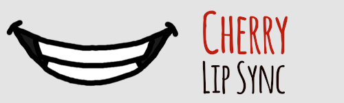

# Cherry Lip Sync

Cherry Lip Sync allows you to create 2D mouth animations from voice recordings
or artificially generated voices. It analyzes your audio files, decides which
mouth shapes are appropriate, then generates lip sync information. You can use
it to animate characters for computer games, create animated content, or create
talking avatars.

Currently Cherry Lip Sync is a standalone tool but integrations are planned for
other software applications.

https://github.com/user-attachments/assets/def2b571-02ee-42ed-9eac-9e83ba759bb5

## Demo Video

https://github.com/user-attachments/assets/aefe9b3f-50bf-4406-9ccf-81592758a022

The above video demonstrates lip sync output driving mouth pictures using
Creative Commons licensed audio clips with no text provided. Animation sequences
were directly from Cherry Lip Sync without additional editing.

## Mouth Shapes

Cherry Lip Sync uses 12 mouth shapes. The first 6 are the *basic mouth shapes*.
The remaining 6 are the *extended mouth shapes*.

| Label | Description | Alternative |
| ----- | ----------- | ----------- |
| A     | Closed mouth for "B", "M", "P" | |
| B     | Slightly open mouth with teeth closed. For consonants like "D", "K", "T". | |
| C     | Open mouth. Used for vowels like "EH". | | 
| D     | Wide open mouth. Used for vowels like "AH". | |
| E     | Rounded open mouth. Used for vowels like "OH". | |
| F     | Puckered lips. Use for "W" and "OO" sounds. | |
| G     | Bottom lip touching upper teeth. For "F" and "V" sounds. | B |
| H     | Tongue touching upper teeth. For "L" sound. | C |
| I     | Wide mouth showing teeth for "EE" sound. | B |
| J     | Shape for "CH", "J", "SH". | B |
| K     | Rounded mouth with teeth closed for "R" sound. | E |
| X     | Idle position. Resting mouth for silence. | A |

Cherry Lip Sync will always output all the mouth shapes. If you don't have all
the extended shapes available then you can copy from the basic shapes. The
closest basic shape is given in the table above under "Alternative".

## Command Line Options

The command line tool is very basic. Options are:

    Cherry Lip Sync allows you to create 2D mouth animations from voice recordings
    or artificially generated voices.

    Usage: cherrylipsync [OPTIONS] --input <INPUT>

    Options:
      -i, --input <INPUT>    Path to input audio
      -o, --output <OUTPUT>  Path to output file to generate, or "-" to write to stdout [default: -]
      -f, --fps <FPS>        Desired FPS of output frames [default: 30]
          --filter           Filter single frame output frames
      -h, --help             Print help
      -V, --version          Print version

## Input Format

Input audio can be in `.mp3`, `.ogg`, `.wav`, and `.flac` formats. Internally
all audio is converted to 32-bit mono at 16 kHz for analysis. If you are having
trouble getting things working or experience audio timing issues you can
manually convert your audio to 16 kHz mono in `.wav` format to rule out any
problems with the input conversion.

The lip sync model used by Cherry Lip Sync is currently solely trained on
English language audio so will probably give the best results with English
language input. Other languages that share phonemes with English will probably
give better results than languages with fewer similarities to English.

Input audio should be as clean as possible. Extraneous noises may be interpreted
as vocal sounds requiring lip movements.

## Output Format

The output format is tab-separated values format (TSV). Each line contains a
time as a floating point number measured in seconds since the start of the audio
clip, followed by a `TAB` character, then a single letter indicating the viseme
for that time. The letter is from the set `ABCDEFGHIJKX`. The fist viseme
at time `0` may or may not be `X`. The final viseme on the last line will always
be `X`.

Example:

    0.000   X
    0.133   C
    0.200   G
    0.300   I
    0.367   K
    0.400   E
    0.500   C
    0.567   A
    0.600   B
    0.633   X

## Model

For information about the model and training, see [Cherry Lip Sync
Model](./docs/model.md).

## Comparison with Rhubarb

For a video comparison with Rhubarb and some other notes, see [Comparison with
Rhubarb](./docs/comparison.md).

## Supported Platforms

Cherry Lip Sync currently supports the following platforms in binary releases:
* Linux, x86-64, most distributions
* Windows, 64-bit
* macOS, Apple silicon

Other major platforms should be able to compile and run the source code.

## License

Cherry Lip Sync is dual-licensed under Apache 2.0 and MIT terms. See
[LICENSE-APACHE](./LICENSE-APACHE) and [LICENSE-MIT](./LICENSE-MIT) for details.
See [NOTICE](./NOTICE) for more licensing information about dependencies.
